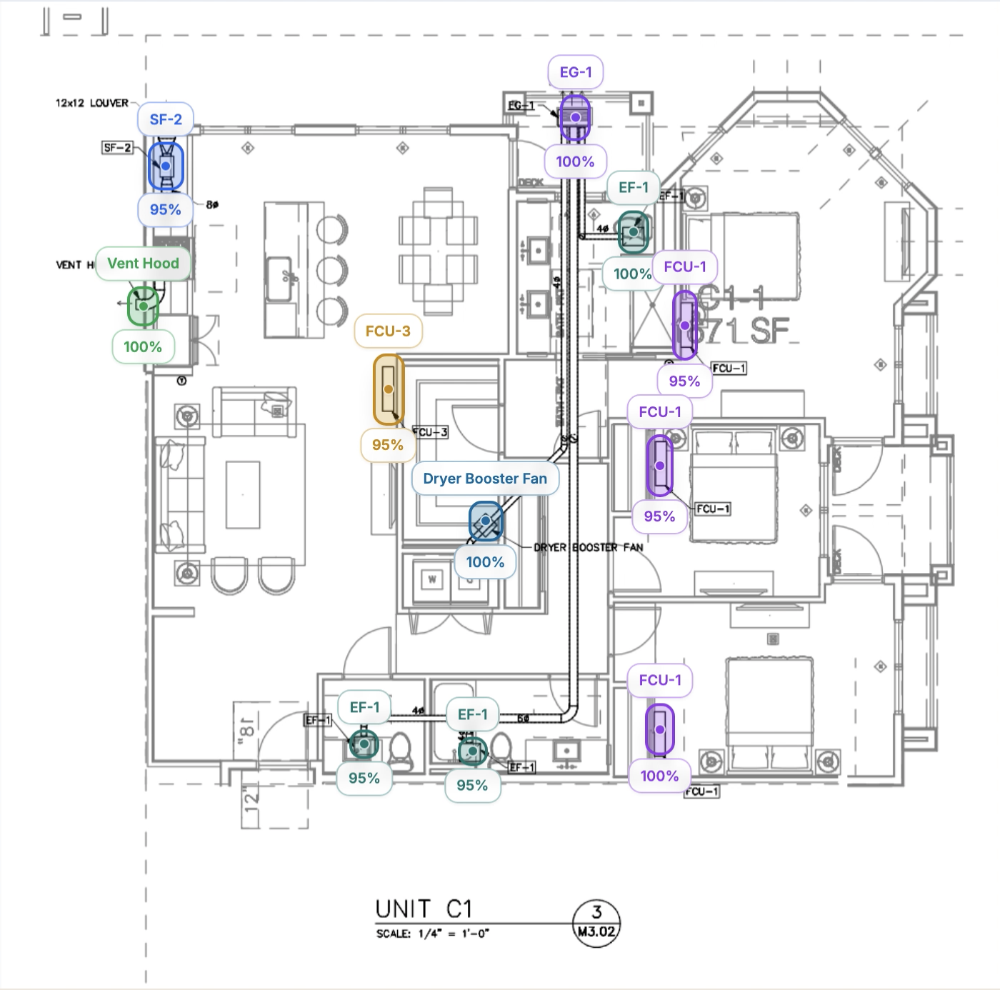

# MechCount

AI-assisted blueprint analysis platform for detecting and counting mechanical symbols — built to solve a real, time-consuming problem faced by mechanical estimators every day.

## The Problem

Mechanical estimators spend hours manually counting symbols across dense, multi-page blueprints before they can produce a bid. A single missed valve or fitting can throw off an entire estimate. This tedious, error-prone process is a known pain point in the mechanical contracting industry — and it's still done by hand at most firms.

MechCount automates it.

## Who This Is For

**Mechanical estimators** at HVAC, plumbing, and piping contractors who need to:
- Rapidly count and categorize mechanical symbols (valves, fittings, fixtures, etc.) across blueprint drawings
- Reduce manual counting errors that lead to inaccurate bids
- Keep a searchable history of past blueprint analyses tied to specific projects

Whether you're a one-person estimating department or part of a larger team, MechCount turns a 2-hour manual count into a sub-minute automated analysis.

## What This Project Does

- Upload blueprint images and run AI-powered symbol detection
- Group detections by category and summarize counts/confidence
- Review and manually correct any detections before finalizing
- Save analyses to project history for future reference
- Manage multiple projects and their associated blueprints

## Current Status & Known Limitations

MechCount is an active work-in-progress built as a portfolio project. The full platform — authentication, file uploads, project management, detection review, and analytics — is functional end-to-end.

The area I'm actively improving is **AI detection accuracy**. The current model detects many mechanical symbols correctly, but struggles with:
- Symbols that are densely packed or overlapping
- Less common symbol variants across different blueprint styles
- Precise bounding box placement on smaller symbols

This is the core engineering challenge I'm focused on. My next steps are experimenting with fine-tuned vision models trained on mechanical drawing datasets and improving the prompt engineering around spatial localization.

Everything outside of detection accuracy — the upload flow, manual correction tools, charts, and project history — works as intended and reflects production-level thinking in architecture and code quality.


## Demo

**Watch MechCount in action**

<p align="center">
  <a href="https://youtu.be/HYlSyUR6CBI?si=2FYBLaiUJLThkIma">
    
  </a>
</p>

<p align="center">
  <a href="https://youtu.be/HYlSyUR6CBI?si=2FYBLaiUJLThkIma">Play full demo video</a>
</p>

- Upload a mechanical blueprint
- Detect symbols with AI
- Review and correct detections
- Analyze category + symbol count charts

## Video Walkthroughs

### 1) Upload Blueprint (0:45)
<a href="https://youtu.be/nAkwM4y8Se8">
  
</a>

[Play video](https://youtu.be/nAkwM4y8Se8)

What to look for:
- Accepted file types and upload flow
- Processing/loading states
- Project assignment behavior

### 2) AI Symbol Detection (1:10)
<a href="https://youtu.be/ZqeYG3nY_YY">
  
</a>

[Play video](https://youtu.be/ZqeYG3nY_YY)

What to look for:
- Detection overlays and confidence labels
- Symbol-name coloring
- Auto-assigned categories

### 3) Review & Correct Detections (1:20)
<a href="https://youtu.be/ZWPPgPOTw5U">
  
</a>

[Play video](https://youtu.be/ZWPPgPOTw5U)

What to look for:
- Rename and recategorize symbols
- Move/resize detection boxes
- Save updated symbol data

### 4) User Authentication
<a href="https://youtu.be/HbCndXqhEeM">
  
</a>

[Play video](https://youtu.be/HbCndXqhEeM)

What to look for:
- Sign up/login flow
- Auth UI behavior
- Session handling experience

### 5) Save to Project History (0:40)
<a href="./public/MechCountDemo-DeleteSymbolAndSaveBlueprinInCreatedProject.mp4">
  
</a>

[Play video](./public/MechCountDemo-DeleteSymbolAndSaveBlueprinInCreatedProject.mp4)

What to look for:
- Save workflow
- History retrieval
- Blueprint detail reload

## Feature Highlights (Timestamps)

| Feature | Video | Timestamp | Notes |
|---|---|---:|---|
| Upload + analyze | End-to-end demo | 0:08 | Starts AI analysis pipeline |
| Symbol overlays | AI detection | 0:22 | Name-level colored detections |
| Manual correction | Review flow | 0:41 | Rename and recategorize |
| Charts update | Analytics | 0:30 | Category + symbol counts |
| Save to history | History flow | 0:18 | Stores blueprint analysis |

## Tech Stack

- Frontend: React, TypeScript, Vite, Tailwind, Recharts, Firebase Auth
- Backend: Node.js, Express, TypeScript, MongoDB (Mongoose)
- Infra services: Firebase Admin, AWS S3, OpenAI API

## Architecture

1. Frontend uploads blueprint + metadata to backend.
2. Backend stores image (S3), persists metadata (MongoDB), and runs AI analysis.
3. Frontend reads blueprint/project resources via authenticated API endpoints.

## Prerequisites

- Node.js 20+
- npm 10+
- MongoDB instance
- Firebase project + service account
- AWS S3 bucket + credentials
- OpenAI API key

## Quick Start (Local)

1. Install dependencies:
   ```bash
   npm ci
   npm ci --prefix backend
   ```
2. Create env files:
   ```bash
   cp .env.example .env
   cp backend/.env.example backend/.env
   ```
3. Fill required env values in `.env` and `backend/.env`.
4. Start backend:
   ```bash
   npm run backend:dev
   ```
5. Start frontend:
   ```bash
   npm run dev
   ```
6. Open `http://localhost:5173`.

## Environment Variables

Frontend (`.env`):
- `VITE_API_BASE_URL` (for example `http://localhost:3000`)
- Firebase client variables (`VITE_FIREBASE_*`)

Backend (`backend/.env`):
- `PORT`, `FRONTEND_URL`, `NODE_ENV`
- `MONGODB_URI`
- Firebase admin variables
- AWS S3 variables
- `OPENAI_API_KEY`

## Scripts

Frontend:
- `npm run dev`
- `npm run lint`
- `npm run typecheck`
- `npm run build`
- `npm run check` (lint + typecheck + frontend build + backend build)

Backend:
- `npm run backend:dev`
- `npm run backend:build`

## Quality Gates

The repository includes GitHub Actions CI at `.github/workflows/ci.yml`:
- Frontend lint + build
- Backend TypeScript build
